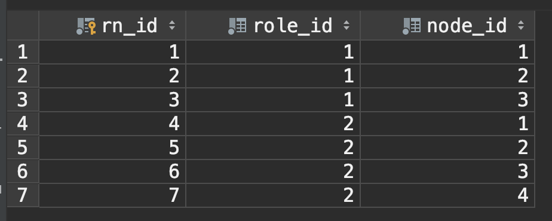

# oa

Branch 'main' set up to track remote branch 'main' from 'origin'.
* alibaba 

## 系统演示
用户:业务岗
用户名:t6 
密码:test

用户:管理岗
用户名:t7
密码:test


用户:管理岗(boss)
用户名:m8
密码:test

## 技术盘点
* 基于Mybatis,freemarker,servlet,Durid连接池，fastJson
* 系统权限设计
* 敏感数据加密
* LayUI前端框架
* 工作流程设计

## rbac-访问权限管理功能：


角色表

系统功能表


角色-功能，对应表 从而到到限定用户功能


用户表


角色-用户，对应表


## MD5(消息摘要算法第五版)敏感数据加密，加盐混淆
```java

public static String md5Encrypt(String source, Integer salt) {
        char[] ca = source.toCharArray();
        for (int i = 0; i < ca.length; i++) {
            ca[i] = (char) (ca[i] + salt);

        }
        String garble = String.valueOf(ca);
        return DigestUtils.md5Hex(garble);
    }
```

## 工作流程设计：

核心--》表单提交后，生成与之对应的工作流程，不同用户登录后，认领不同的工作节点原始任务表

任务表

流程表

##  MyBatis工作流程
